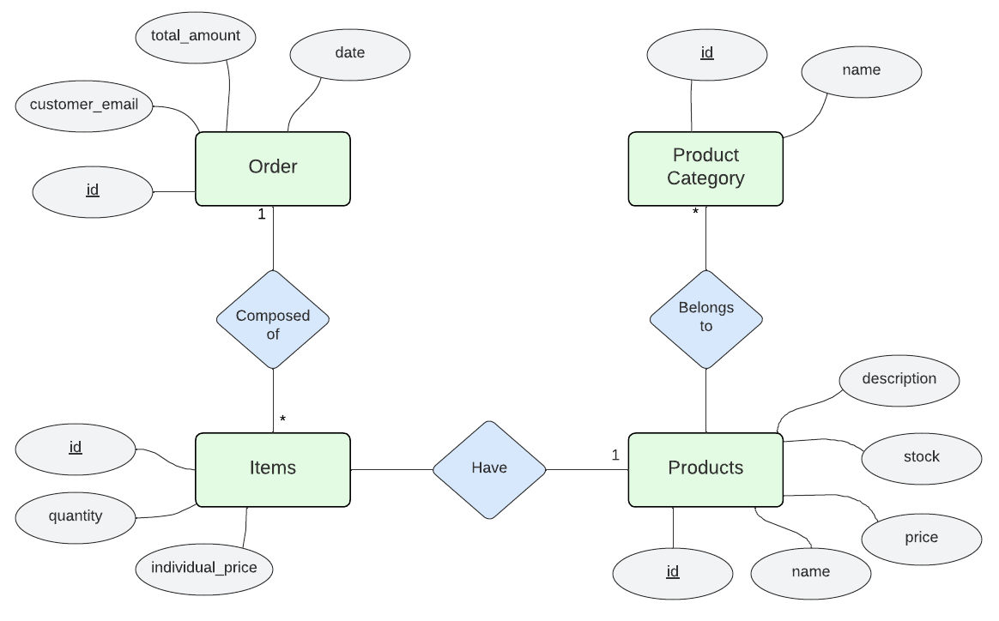

## PROJECT IDEA

A web application dedicated to the registration of product order management of a food sales establishment is presented. Customers will be able to place food orders, and employees will be able to manage them.

## DETAILS OF THE PHP FRAMEWORK PROJECT - LARAVEL:    

It will be registered, for each of the following entities:
- For each **PRODUCT**, its name, description, price and stock.
- For each **ORDER**, the email of the person who placed it, the total price, and the items it contains.
- For each **ITEM**, its quantity.
- For each **PRODUCT CATEGORIES**, its name.

Each customer will be able to place an order at the food establishment, where an order will be generated with the items that the person has requested, which will consist of one or more products.

### UPDATABLE ENTITIES
- Products
- Products_Category

### REPORTS

The following **reports** can be generated:
- A report that contains all the orders that a customer has made.
- A report with the number of orders and money earned per month.
- A report that details the remaining stock of each product.

### OBTAIN AND MODIFY USING API

The following entities can be obtained and modified via API:
- Order
- Items

Additionally, using some filtering mechanism, the following entities can be obtained via API:
- Products
- Products_Category

### Login screen

### Products screen

### Agregando un nuevo producto

### Extras:

#### How to run the project:
Install PHP and composer (you may have to enable certain extensions in the php.ini file).
Create the database using pgAdmin and set the access data to this db in the .env file
On the project's root directory, run:
- composer install
- php artisan migrate (creates the tables)
- php artisan db:seed (fills the tables with data)
- php artisan serve (run the server)
  
#### Docker
On the folder [db-setup-docker](db-setup-docker/) there is a file [docker-compose.yml](db-setup-docker/docker-compose.yml), which runs PostgreSQL and pgAdmin.

