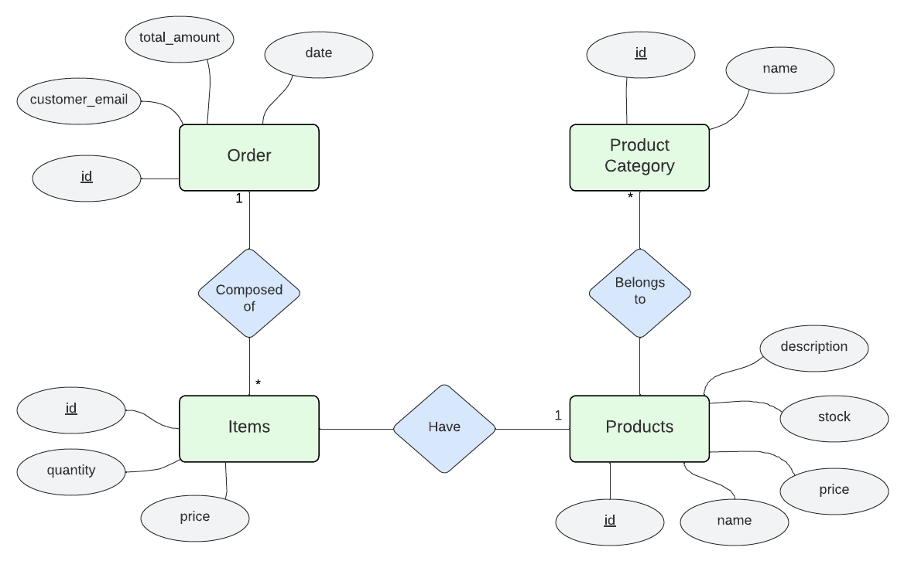

[](https://github.com/rodrikraus/IoT-Impact-laravel/blob/main/README-EN.md)
[](https://github.com/rodrikraus/IoT-Impact-laravel/blob/main/README.md)

## IDEA DEL PROYECTO

Se presenta una aplicación web dedicada al registro de gestión de pedidos de productos de un establecimiento de venta de comida. Los clientes podrán realizar pedidos de comida, y los empleados podrán gestionarlos.




## DETALLES DEL PROYECTO FRAMEWORK PHP - LARAVEL:

Se va a registrar, para cada una de las siguientes entidades:
- Para cada **PRODUCTO**, su nombre, descripción, precio y el stock.
- Para cada **ORDEN**, el email de la persona que lo hizo, el precio total, y los items que contenga.
- Para cada **ITEM**, su cantidad.
- Para cada **CATEGORÍAS DE PRODUCTO**, su nombre.

Cada cliente podrá hacer un pedido al establecimiento de comida, en donde se va a generar una orden con los items que la persona haya solicitado, la cual va a consistir de uno o mas productos.


### ENTIDADES ACTUALIZABLES

Se podrán actualizar:
- Products
- Products_Category

### REPORTES

Se pueden generar los siguientes **reportes** :
- Un reporte que contenga todos los pedidos que haya hecho un cliente.
- Un reporte con la cantidad de pedidos y dinero ganado por mes.
- Un reporte que detalle el stock restante de cada producto.

### OBTENCIÓN Y MODIFICACIÓN MEDIANTE API

Se podrán obtener y modificar por API las siguientes entidades:
- Order
- Items

Además, utilizando algún mecanismo de filtrado, se podrá obtener por API las siguientes entidades:
- Products
- Products_Category


## DETALLES DEL PROYECTO JAVASCRIPT - REACT:

### INFORMACIÓN OBSERVABLE POR EL USUARIO

El usuario podrá ver todos los productos disponibles, con su precio y descripción.
También podrá ver su pedido actual y su historial de pedidos.

### ACCIONES REALIZABLES POR EL USUARIO

El usuario podrá armar su pedido agregando productos a su carrito, para luego decidir si cancelar su compra o confirmar su pedido. Luego podrá consultar el mismo o consultar su historial de pedidos.

---


### Extras:

#### Comandos útiles:
En la carpeta raíz del proyecto:

``` 
composer install
cp .env.example .env
php artisan key:generate
npm install
npm run build
php artisan migrate
php artisan db:seed
php artisan serve
```
#### Docker
En la carpeta [db-setup-docker](db-setup-docker/) se encuentra el archivo [docker-compose.yml](db-setup-docker/docker-compose.yml), el cual levanta PostgreSQL y pgAdmin.


