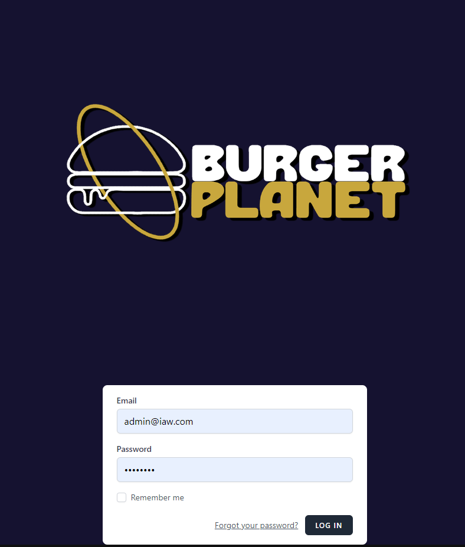
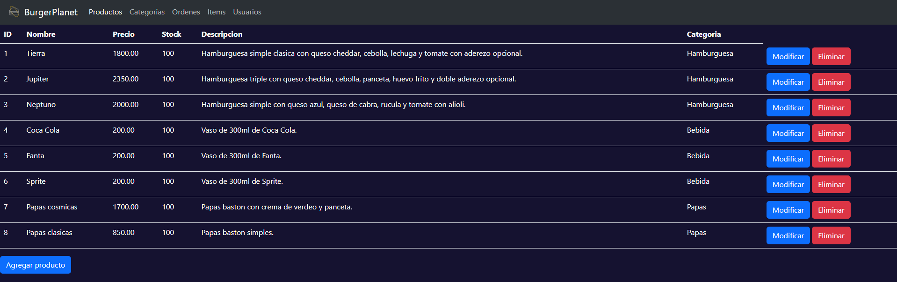

## Deploys
### Vercel:
https://iot-impact-js.vercel.app/

http://iot-impact-laravel.vercel.app/

### AWS Amplify:
https://deploy.dza6lgfhpbee3.amplifyapp.com/
### Raspberry Pi:
https://burger-planet.chewer.net/

https://admin-burger-planet.chewer.net/

---

### Todos los repos del proyecto:
- https://github.com/iaw-2023/IoT-Impact-js/
- https://github.com/iaw-2023/IoT-Impact-laravel/
- https://github.com/iaw-2023/IoT-Impact-nodejs/

---

## IDEA DEL PROYECTO

Se presenta una aplicación web dedicada al registro de gestión de pedidos de productos de un establecimiento de venta de comida. Los clientes podrán realizar pedidos de comida, y los empleados podrán gestionarlos.

## DETALLES DEL PROYECTO FRAMEWORK PHP - LARAVEL:

Se va a registrar, para cada una de las siguientes entidades:
- Para cada **PRODUCTO**, su nombre, descripción, precio y el stock.
- Para cada **ORDEN**, el email de la persona que lo hizo, el precio total, y los items que contenga.
- Para cada **ITEM**, su cantidad.
- Para cada **CATEGORÍAS DE PRODUCTO**, su nombre.

Cada cliente podrá hacer un pedido al establecimiento de comida, en donde se va a generar una orden con los items que la persona haya solicitado, la cual va a consistir de uno o mas productos.

### ENTIDADES ACTUALIZABLES

Se podrán actualizar:
- Products
- Products_Category

### REPORTES

Se pueden generar los siguientes **reportes** :
- Un reporte que contenga todos los pedidos que haya hecho un cliente.
- Un reporte con la cantidad de pedidos y dinero ganado por mes.
- Un reporte que detalle el stock restante de cada producto.

### OBTENCIÓN Y MODIFICACIÓN MEDIANTE API

Se podrán obtener y modificar por API las siguientes entidades:
- Order
- Items

Además, utilizando algún mecanismo de filtrado, se podrá obtener por API las siguientes entidades:
- Products
- Products_Category

### Login screen

### Products screen

### Agregando un nuevo producto

## DETALLES DEL PROYECTO JAVASCRIPT - REACT:

### INFORMACIÓN OBSERVABLE POR EL USUARIO

El usuario podrá ver todos los productos disponibles, con su precio y descripción.
También podrá ver su pedido actual y su historial de pedidos.

### ACCIONES REALIZABLES POR EL USUARIO

El usuario podrá armar su pedido agregando productos a su carrito, para luego decidir si cancelar su compra o confirmar su pedido. Luego podrá consultar el mismo o consultar su historial de pedidos.

---

### Extras:

#### Como correr el proyecto:
Instalar PHP y composer (para instalar composer en windows quizas sea necesario activar todas las extensiones en el archivo php.ini).
Crear la base de datos en pgAdmin y poner los datos de accesso en el archivo .env
Estando en la carpeta raíz del proyecto correr:
- composer install
- php artisan migrate (crea las tablas en la base de datos)
- php artisan db:seed (ejecuta los seeders, llenando las tablas de la base de datos con los datos que especifique el seeder)
- php artisan serve (levantar el servidor)

#### Docker
En la carpeta [db-setup-docker](db-setup-docker/) se encuentra el archivo [docker-compose.yml](db-setup-docker/docker-compose.yml), el cual levanta PostgreSQL y pgAdmin.

